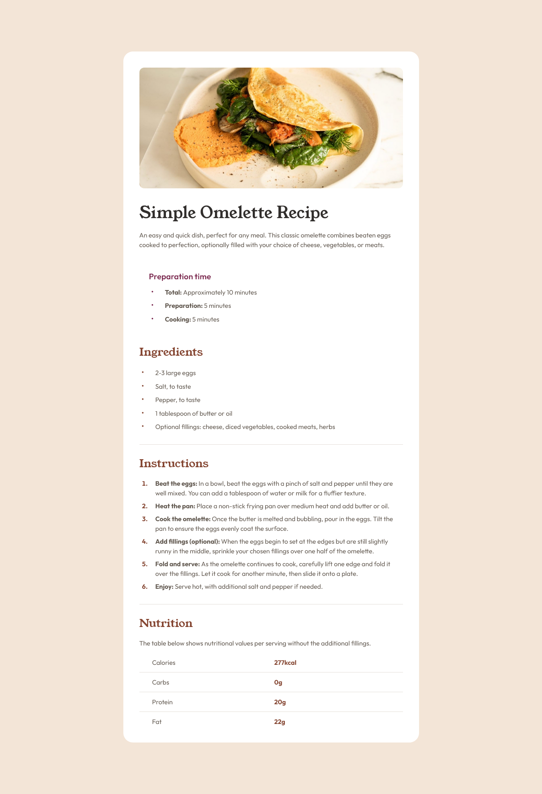

# Frontend Mentor - Recipe page solution

This is a solution to the [Recipe page challenge on Frontend Mentor](https://www.frontendmentor.io/challenges/recipe-page-KiTsR8QQKm). 

### Built with

- Semantic HTML5 markup
- CSS custom properties
- SCSS custom properties
- Flexbox
- CSS Grid
- Mobile-first Responsive Design

## Author

- Frontend Mentor - [@MGiorgi96](https://www.frontendmentor.io/profile/MGiorgi96)
